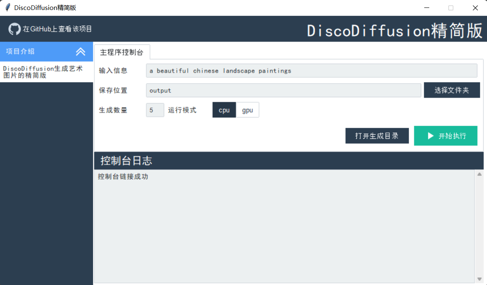

## 项目介绍
基于 [DiscoDiffusion](https://github.com/alembics/disco-diffusion) 的精简版，方便学习和扩展。
- 目前只支持通过提升文本生产图片的功能，去掉了视频、VR、3D等功能。
- 同时支持图形界面（GUI）方式启动，目前界面还很简单，后续会慢慢优化。
- 有一个windows版打包程序，解压后双击app.exe即可启动（Pyinstaller打包的程序会被杀毒软件误认为是木马，可添加信任，如果不放心可以支持下载源码自己运行）。



## 快速开始
```bash
# 安装依赖
pip install -r requirements.txt
# 下载模型并放到models目录下
https://drive.google.com/drive/folders/1nVae7WmWuZx7Syx_sKBBhCxx4TuJ99ls
# 运行代码
python discodiff.py
# 或运行界面程序（仅在window下做过测试）
python gui.py
```
### 运行安装包
下载[安装包]()，解压后双击app.exe即可启动。

### 自己打包
```bash
pyinstaller app.spec --noconfirm --clean
```
打包完成后运行`dist/app.exe`即可启动。

## 感谢如下项目
- [DiscoDiffusion](https://github.com/alembics/disco-diffusion)
- [QGUI](https://github.com/QPT-Family/QGUI)
